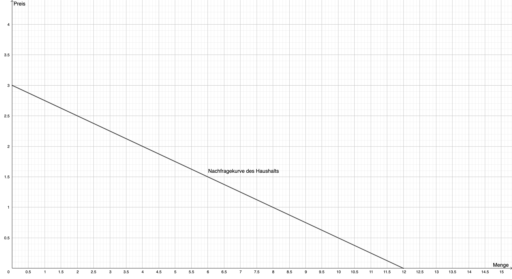
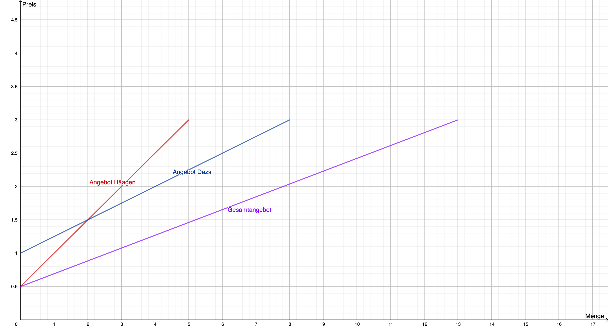
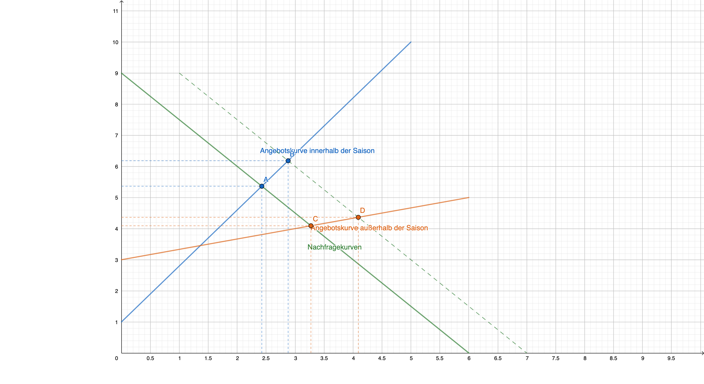

# Management Basics - VWL

Vorlesung vom *2020-01-18*

## Grundsätzliches & Wiederholung

- Einstieg in die Wirtschaftswissenschaften
  - Unbegrenzte Bedürfnisse
    - Vgl. Maslow Pyramide
  - Güter werdne klassifiziert
    - freie und knappe Güter
  - ökonomisches Prinzip
    - Maximal- oder Minimalprinzip
  - TradeOff
    - Opportinutätskosten
    - Komparativer Kostenvorteil (nach David Ricardo)
  - Unterschied Marktwirtschaft und Planwirtschaft
  - Man muss auch die anderen Wirtschaftswissenschaftler für die Klausur kennen
    - Adam Smith
    - David Ricardo
    - John Keynes
    - siehe Folien für mehr
  - Markt hat zwei Funktionen
    - Motivationsfunktion
    - Koordinationsfunktion

## Angebot und Nachfrage

Nachfrageseite sind meistens Haushalte und deren Konsum
Angebot ist von Unternehmenssicht und der Herstellung

Die nachgefrage Menge ist vom Preis abhängig; je teuerer desto geringer die
Nachfrage. Andere Faktoren werden grundsätzlich ignoriert (bzw. die Faktoren
sind konstant, nut Preis ist variable).

> In diesem Kurs wird nur von linearen Abhängigkeiten ausgegangen

Menge auf der x-Achse, Preis auf der y-Achse

Warum das so ist, kein Plan.

Prohibitivpreis = der Preis, wo niemand mehr das Produkt kauft

Sättigungsmenge = Menge bei der jeder das Produkt kauft

Gesamtnachfrage = Nachfrage Haushalt 1 + Nachfrage Haushalt 2

### Verschiebung von Nachfragekurven

Ein höheres Einkommen heißt, dass man eine höhere Nachfrage hat, beim gleichen
Preis. Die Nachfragekurve verschiebt sich nach außen (rechts).

#### Faktoren (Determinanten), dass die Nachfrage beeinflussen

- Aktuelle Trends
- Preise andere Güter
- Anzahl der Haushalte am Markt
- Alterne Bevölkerung
- Wealth distribution

#### Aufgabe 5

1. Wie wirken sich die Warnhinweise auf den Zigarettenpackungen auf die
   Nachfrage aus?
   - Nachfragekurve wird nach innen verschoben, weil sich ein anderer Faktor als
     der Preis ändert
2. Wie wirkt sich eine Zigraettensteuer aus?
   - Die Nachfragekurve bleibt gleich, weil sich nur der Preis ändert

### Steigung der Nachfragekurve

Flachere Kurven haben eine höhere Preiselastizität, weil eine bestimmte
Preiserhöhung hohe Mengenreduktion verursacht

Vertikale Nachfragekurve nennt sich vollkommen unelastisch. Es ist egal, wie
teuer das Produkt ist. Die nachgefragte Menge bleibt immer gleich groß

Horizontale Nachfragekurve nennt sich vollkommen elastisch. Wenn sich der Preis
ändert, ist die nachgefragte Menge unendlich verschieden.

Die Preiselastizität lässt sich mit einer Formel berechnen:

$$\epsilon_{q,p} = \frac{\frac{\Delta q}{q}}{\frac{\Delta p}{p}}$$

Wenn $\epsilon_{q,p} < -1$ Nachfrage reagiert elastisch.

Wenn $\epsilon_{q,p} = -1$ Nachfrage reagiert proportional elastisch (isoelastisch).

Wenn $0 > \epsilon_{q,p} > -1$ Nachfrage reagiert unelastisch.

#### Aufgabe 6

Preis steigt von €2.00 auf €2.20. Nachfrage fällt von 10 auf 8. Berechne die
Preiselastizität!

$$
\epsilon_{q,p} = \frac{\frac{\Delta q}{q}}{\frac{\Delta p}{p}}\\
\epsilon_{q,p} = \frac{\frac{-2}{10}}{\frac{0.2}{2}}\\
\epsilon_{q,p} = \frac{-0.2}{0.1}\\
\epsilon_{q,p} = -2
$$

Der Preis ist elastisch.

### Kreuzpreiselastizität

Wie verändert sich die Nachfrage, wenn sich der Preis anderer Güter ändert?

$$\epsilon_{q_{D,i},p_j} = \frac{\frac{\Delta q_{D,i}}{q_{D,i}}}{\frac{\Delta
p_j}{p_j}}$$

Wenn $\epsilon < 0$ Komplementärgüter
Wenn $\epsilon > 0$ Substitutionsgüter
Wenn $\epsilon = 0$ unverbundene Güter

### Determinanten des Angebots

- Kosten für Produktion
- Technischer Fortschritt

### Angebotskurve

#### Aufgabe 9

Welche Einflussfaktoren können eine Verschiebung der Marktangebotskurve
bewirken?

- Anzahl der Unternehmen
  - Verschiebung nach außen, wenn Anzahl höher
- Hohe Kosten
  - Verschiebung nach innen, wenn Kosten höher

### Elastizität der Angebotskurve

Kleine Mengenerhöhung bei bestimmter Preiserhöhung: geringe Elastizität; hohe Steigung

Große Mengenerhöhung bei bestimmter Preiserhöhung: hohe Elastizität; geringe
Steigung

Vollkomene (un)elastizität ist genauso wie bei der Nachfrage. Vertikale Linie
ist vollkommen unelastisch, horizontale Angebotskurve ist vollkommen elastisch.

$$\epsilon_{q,p} = \frac{\frac{\Delta q}{q}}{\frac{\Delta p}{p}}$$

Wenn $\epsilon_{q,p} > 1$ Angebot reagiert elastisch

Wenn $\epsilon_{q,p} = 1$ Angebot reagiert proportional elastisch (isoelastisch)

Wenn $0 < \epsilon_{q,p} < 1$ Angebot reagiert unelastisch

### Aufgabe 10

### Zusammenspiel von Angebot und Nachfrage

- Gleichgewicht
  - Gleichgewichtspreis
  - Gleichgewichtsmenge
- Gravitation zum Gleichgewicht
  - Angebotsüberhang
  - Nachfrageüberhang
- Verschiebungen der Kurven
  - Verschiebung nach Außen heißt höhere Gleichgewichtsmenge
  - Vershciebung nach Innen heißt geringere Gleichgewichtsmenge

| Nachfrage \ Angebot | Rückgang | Gleich   | Anstieg  |
| ------------------- | -------- | -------- | -------- |
| Rückgang            | P ⍉, Q ↓ | P ↓, Q ↓ | P ↓, Q ⍉ |
| Gleich              | P ↑, Q ↓ | P =, Q = | P ↓, Q ↑ |
| Anstieg             | P ↑, Q ⍉ | P ↑, Q ↑ | P ⍉, Q ↑ |

### Vollkommender Markt

Die Graphen, die bei Angebots und Nachfragefunktionen gezeichnet wurden, gelten
nur für vollkommende Märkte.

### Effizienz von Märkten

TODO
