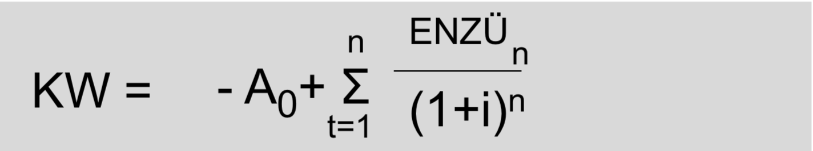

# Schwerpunkte zum Lernen - Teil BWL

- Multiple Choice Teil (richtig/falsch)
  - Marketing
- Rechnungsteil
  - Alle Kennzahlen
    - EBIT
    - Rentabilität
    - Annuität
    - Cash Flow
    - Ertragswerte

## Rechnungsteil

Dieser Abschnitt enthält alle Formeln zu auswenig lernen. Viel Spaß 🤮

### Grundlagen Rechnungswesen

### Liquidität

### Anlagendeckungsgrad

### Cash Flow

TBD

### EBITDA

TBD

### Rentabilitäten

#### Eigenkapital-Rentabilität

#### Gesamtkapital-Rentabilität

Zinsen werden hinzugefügt, weil Fremdkapital die Zinsen beinhaltet und diese
durch die Addition bereinigt werden.

#### Betriebsrentabilität & Betriebsnotwendiges Vermögen

#### Umsatzrendite

oder

### Investition

#### Statische Amortisation

Bei der statischen Amortisation wird nicht abgezinst.

$$Amortisationszeit = \frac{Anschaffungskosten}{durchschnittliche\ Erlöse\ pro\ Jahr}$$

#### Dynamische Amortisation

Ähnlich der statischen Amortisation, nur dass hier abgezinst wird. Der Zinssatz
ist davon abhängig, wie viel Geld wir durch andere Investitionen erwarten würden
(Im ersten Semester wird dieser Wert vorgegeben - 8% ist ein guter Richtwert).

#### Kapitalwertmethode

### Finanzierung

#### Annuitätendarlehnen

#### Berechnung für die Kosten von Nichtausnutzung des Skontos

### Aktienkurse / Ertragswertkurse

#### Begrenzte Lebensdauer und ungleiche Nettoeinzahlungen

Für die Berechnung von Anteilen, die man bis drei Jahre plant zu haben.

#### Begrenzte Lebensdauer und gleiche Nettoeinzahlungen

Für Berechnungen von Anteilen, die man zwischen drei und 10 Jahren plant zu haben.

#### Ungebrenzte Lebensdauer und gleiche Nettoeinzahlungen

Für Berechnungen von Anteilen, die man über 10 Jahren plant zu haben.

#### Mittelkurs nach ausgabe neuer Aktien

#### Rechnerischer Wert des Bezugsrechtes

### Risiken

Generelle Formel:

$$Risiko = Eintrittswahrscheinlichkeit\cdot Kosten\ bei\ Eintritt$$

#### ROI-Schema

#### Leverage Effekt

### VWL

#### Preiselastizität

#### Kreuzpreiselastizität

#### Volkswirtschaftliche Gesamtrechnung

##### Entstehungsrechnung

##### Verwendungsrechnung

BIP(Y) = Konsum(C) + Staatskonsum(G) + Investitionen(I) + Nettoexporte(NX)

#### Verschiedene Quoten

Staatsquote = G / Y
Investitionsquote = I / Y
Exportquote = X / Y
Importquote = Im / Y
Nettoexportquote = NX / Y
Konsumquote = C / Y

#### BIP Deflator

